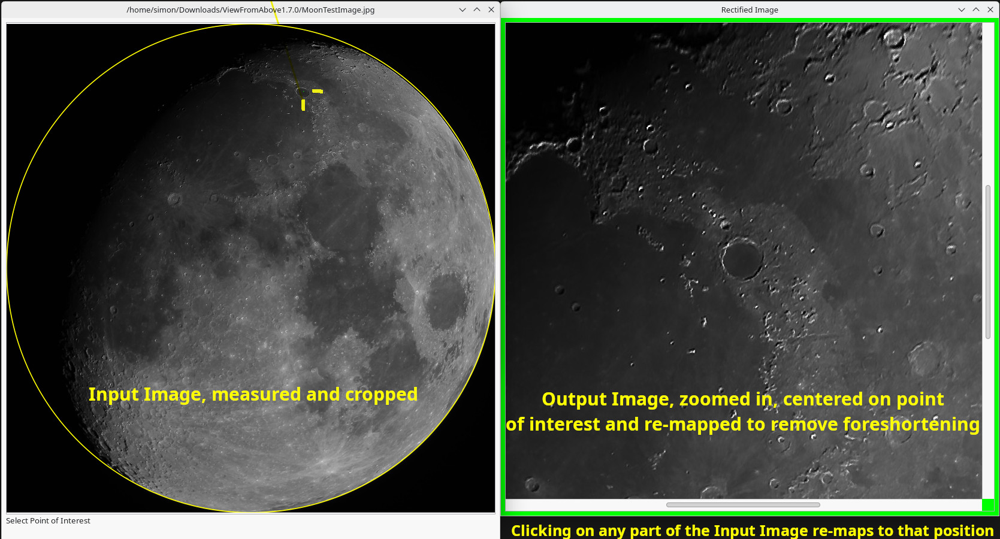
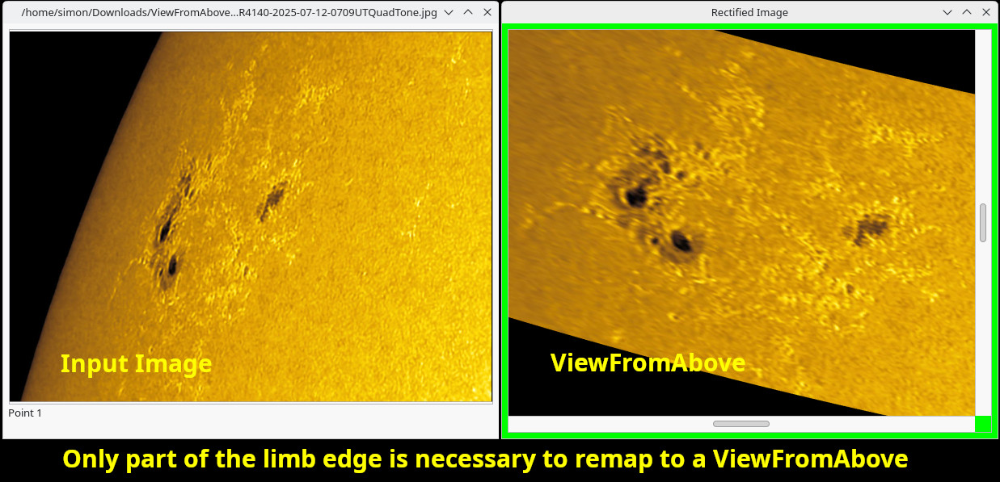

# ViewFromAbove
Software to rectify Solar and Lunar Images to see features on the surface as they would appear if viewed from above, thus removing any foreshortening of features on the limb of these objects.

## Screenshots

## Installation
### Using Installation binaries
If you have a Debin,Ubuntu or derivative distribution that can process *.deb files then simply download the appropriate *.deb file from here https://github.com/SimonTelescopium/ViewFromAbove/releases once downloaded, double click it this will open your software center where you can click Install.
### Installation - From Source
To install from source, download and un-pack the source files then open the project in Gambas*, from there you can make an executable (project menu). Gambas is available from the software store on many distributions, otherwise install from their website.

*Gambas https://gambaswiki.org/website/en/main.html is a Visual BASIC like, language and IDE for Linux, offering object oriented, event driven Basic - it is pretty fast too.

## About the Author
Note: I'm a hobbiest coder, far from professional, so if you find my code objectional then don't use it, if you think it's poorly executed - you are probably right - if you have something constructive to say to help me learn, then please use language a beginner hobbiest will understand and be gentle I spent a lot of my free time learning to code this - This is my first coding project with a UI for quite some time (read decades).
